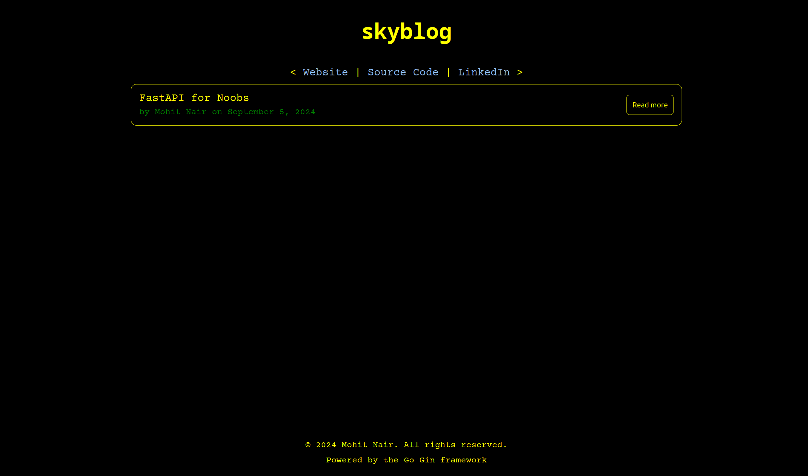

# skyblog: Self-Hosted Blogging Framework

## Overview

Skyblog is a simple, self-hosted blogging framework written in Go, using the Gin web framework. It allows users to easily create and manage their blogs by writing content in Markdown. The framework converts this content into static HTML for efficient serving.

Key Features:
- Markdown-to-HTML conversion for easy blog writing.
- Serve blogs dynamically via URL routing.
- Templates for easy customization.
- Easy-to-extend architecture with support for static files.

## Directory Structure

```
skyblog/
├── app
│   └── endpoints.go         # Defines the HTTP routes for the server
├── blogs                    # Contains blog subdirectories (each blog post)
├── fileops
│   └── ops.go               # Functions for file handling, reading blog metadata, and Markdown conversion
├── static                   # Static assets (CSS, fonts)
│   ├── css
│   │   └── style.css        # Blog styles
│   └── fonts
│       ├── cprime.woff2     # Custom fonts
│       └── ubuntu.woff2
├── templates                # HTML templates for rendering the blog and error pages
│   ├── 404.html
│   ├── blog.html            # Template for rendering individual blog posts
│   └── index.html           # Template for the main blog listing page
├── main.go                  # Entry point of the application
├── README.md                # Documentation
```

## Setup Instructions

### Prerequisites
- **Go** (version 1.18 or higher)
- Git (for cloning the repo)

### Installation

1. **Clone the repository:**
   ```bash
   git clone https://github.com/themohitnair/skyblog.git
   cd skyblog
   ```

2. **Install dependencies:**
   Run `go mod tidy` to download necessary Go modules.
   ```bash
   go mod tidy
   ```

3. **Run the application:**
   ```bash
   go run main.go
   ```

   The server will start on `http://localhost:8000`. You can visit this URL to see your blog homepage.

## Creating Blogs

1. Create a new subdirectory inside the `blogs/` folder. Name the directory using a pattern like:
   ```
   blogs/{blog-number}-{blog-title}
   ```
   Example: `blogs/001-my-first-blog`.

2. Inside your blog directory, add:
   - A `metadata.yaml` file with the following structure:
     ```yaml
     author: "Your Name"
     title: "Title of the Blog"
     date: "September 21, 2024 18:45 [offset] [timezone]" // mentioning offset and timezone accordingly
     ```

   - A `content.md` file containing your blog content in Markdown.

## Example

Add a directory called 1-fastapi-for-noobs inside the blogs directory in the project root. Create a metadata.yaml, content.md and and images directory (All this has already been done for you).

1. Metadata Example:
    ```yaml
    author: Mohit Nair
    title: FastAPI for Noobs
    date: September 5, 2024 18:45 +0530 IST
    ```

2. Content Example:
```markdown
   # FastAPI: Python's Rising Star in Web Development
   
   ---
   
   
   
   ## Why FastAPI?
   
   1. **Lightning Fast**: Built on Starlette and Pydantic, FastAPI delivers high performance that rivals Go and Node.js.
   2. **Easy to Use**: With intuitive design and excellent documentation, FastAPI has a gentle learning curve.
   3. **Modern Python**: Leverages Python 3.6+ features like type hints for increased productivity and fewer bugs.
   4. **Automatic Docs**: Generates interactive API documentation out of the box.
   
   Here's a glimpse of how simple it is to create an API with FastAPI:
   
   \```python
   from fastapi import FastAPI
   
   app = FastAPI()
   
   @app.get("/")
   async def root():
       return {"message": "Hello, FastAPI!"}
   \```
   
   This small snippet gives you a fully functional API with automatic interactive documentation.
   
   
   
   FastAPI's automatic documentation makes it easy for developers to understand and interact with your API, significantly reducing the time spent on creating and maintaining API documentation.
   
   Ready to dive in? Check out the [official FastAPI documentation](https://fastapi.tiangolo.com/) to get started on your FastAPI journey!
```


## Running the Project

1. **Starting the Server:**
   Run the following command from the project root:
   ```bash
   go run main.go
   ```
   Your blog should now be available at `http://localhost:8000`.

2. **Accessing Blogs:**
   Blogs will be listed on the homepage. To view an individual blog, visit the URL:
   ```
   http://localhost:8000/{blog-name}
   ```

You might see something like this:



## Tweaks

### Non-essential directories.
You may delete/remove files/directories such as README.md, LICENSE, README_assets, and 1-fastapi-for-noobs (inside blogs directory).

### Favicon
You can add a favicon to the /static/assets directory. You have to change the HTML if you change the name of the favicon or the file format (currently svg).

### Fonts and CSS
CSS has been drafted in a variable-esque form so that tweaking can be done at one place in the CSS file. The CSS file handles styles in all three HTML templates.

### HTML
The HTML consists of several comments that direct and indicate to what the tags are for. Feel free to edit them.