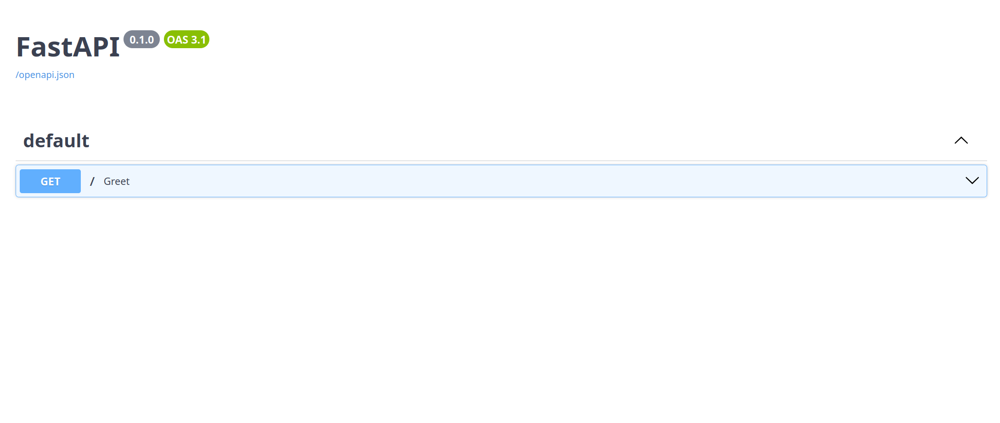

# FastAPI: Python's Rising Star in Web Development

---


## Why FastAPI?

1. **Lightning Fast**: Built on Starlette and Pydantic, FastAPI delivers high performance that rivals Go and Node.js.
2. **Easy to Use**: With intuitive design and excellent documentation, FastAPI has a gentle learning curve.
3. **Modern Python**: Leverages Python 3.6+ features like type hints for increased productivity and fewer bugs.
4. **Automatic Docs**: Generates interactive API documentation out of the box.

Here's a glimpse of how simple it is to create an API with FastAPI:

```python
from fastapi import FastAPI

app = FastAPI()

@app.get("/")
async def root():
    return {"message": "Hello, FastAPI!"}
```

This small snippet gives you a fully functional API with automatic interactive documentation.



FastAPI's automatic documentation makes it easy for developers to understand and interact with your API, significantly reducing the time spent on creating and maintaining API documentation.

Ready to dive in? Check out the [official FastAPI documentation](https://fastapi.tiangolo.com/) to get started on your FastAPI journey!